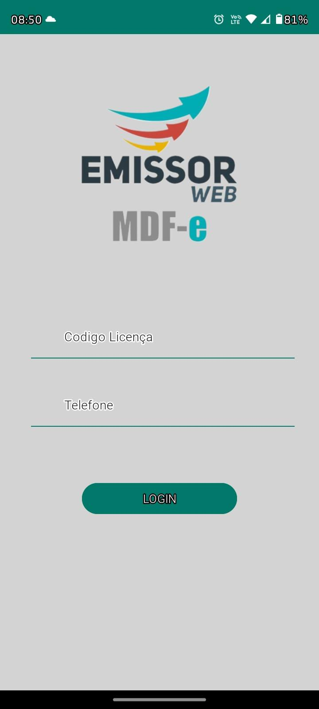
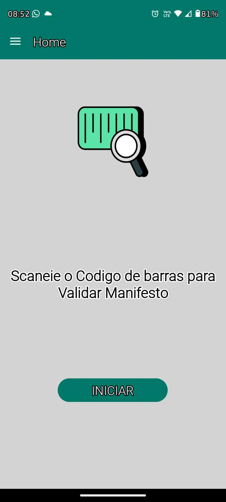
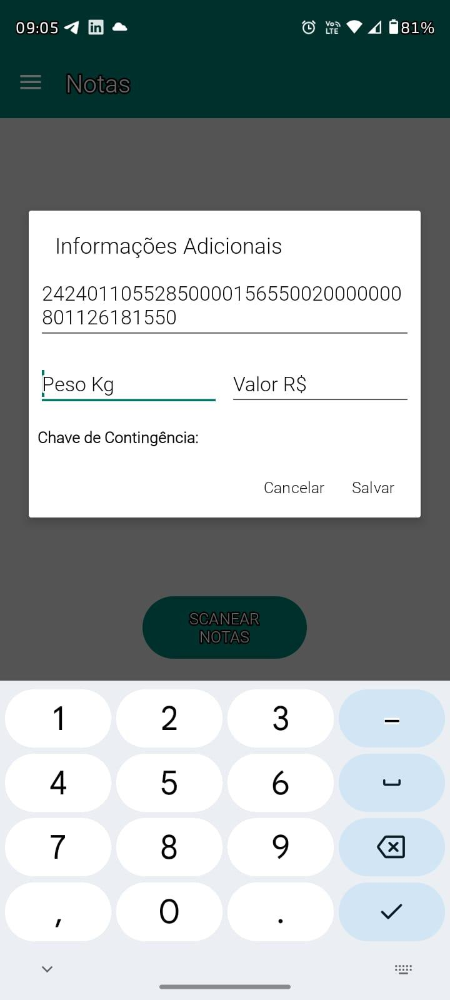
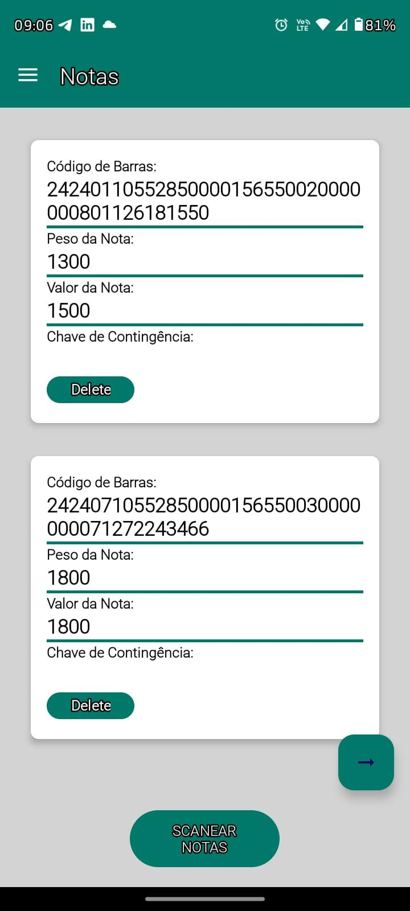
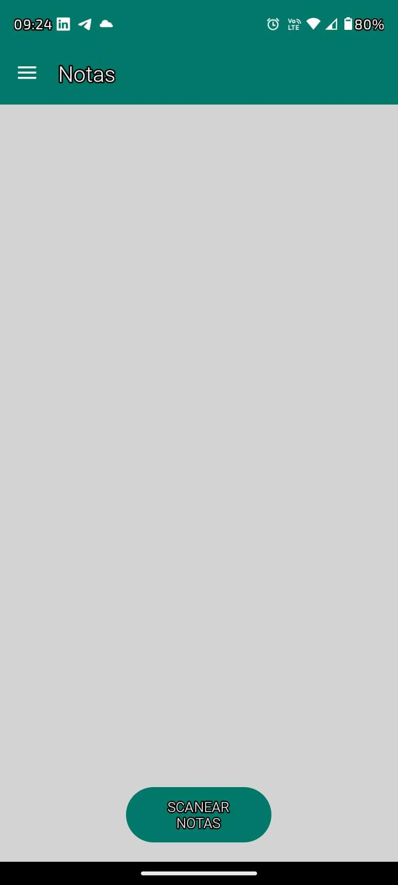

Documentação do Projeto Emissor MDF-e
Visão Geral
O projeto Emissor MDF-e é uma aplicação Android desenvolvida para facilitar a emissão de Manifestos de Documentos Fiscais Eletrônicos (MDF-e). O aplicativo permite que os usuários autentiquem-se, escaneiem códigos de barras, validem informações e enviem dados para uma API. Esta documentação detalha a estrutura do projeto, os componentes principais e as interações entre eles.

Estrutura do Projeto
1. Arquitetura MVVM (Model-View-ViewModel)
O projeto segue a arquitetura MVVM (Model-View-ViewModel) para uma melhor separação de responsabilidades e modularização do código.

Model: Responsável pelos dados da aplicação. Inclui classes que representam os dados e gerenciam a lógica de negócios.
View: Responsável pela interface do usuário. Observa os dados do ViewModel e atualiza a UI em resposta a mudanças.
ViewModel: Responsável por preparar e gerenciar os dados para a View. Mantém o estado da UI e lida com a lógica de apresentação.

2. Pacotes e Classes Principais

2.1. ApiAuth
ApiManager: Gerencia as chamadas de API para autorizar manifestos.

Método testApiCall(Context context, ApiCallback callback): Faz uma chamada de API para autorizar um manifesto usando dados do usuário obtidos do banco de dados.
RetrofitClient: Configura e fornece uma instância de Retrofit para chamadas de API.

Método getInstance(): Retorna uma instância de AuthApi configurada.
AuthApi: Define as chamadas de API para autorizar manifestos.

Método authorizeManifesto(ManifestoRequest2 manifestoRequest): Realiza uma chamada POST para autorizar um manifesto.
ManifestoRequest2: Modelo de requisição para a API.

Campos: id, telefone, manifesto, notas.
2.2. Bd
DatabaseHelper: Gerencia as operações do banco de dados SQLite.
Métodos principais: isUserLoggedIn(), addUser(int id, String phoneNumber, int validationCode), setLoggedIn(int id, boolean isLoggedIn), getUserDetails(), insertManifesto(String manifesto, String timestamp), clearNotas(int userId).
2.3. Validation.Model
Modelos de Dados:
BarcodeData: Representa dados de um código de barras.
ManifestoDataModel: Representa dados de um manifesto.
Nota: Representa uma nota com suas propriedades.
NotaDataModel: Representa dados de uma nota.
User: Representa um usuário com ID e número de telefone.
UserDataModel: Representa dados de um usuário.
UserDataTransferModel: Transferir dados de usuário, manifesto e notas.
UserResponse: Representa a resposta da API com detalhes do usuário.
2.4. Validation.ViewModel
BarcodeViewModel: Gerencia o estado dos códigos de barras.

Métodos principais: setFirstBarcode(String barcode), getFirstBarcode(), setSecondBarcode(String barcode), getSecondBarcode(), setBarcode(String barcode), getBarcode(), setIsContingency(boolean isContingency), getIsContingency(), resetBarcodes().
UserViewModel: Gerencia a autenticação e validação do usuário.

Métodos principais: authenticateUser(String id, String phoneNumber), validateCode(String userId, String code), getUserResponseLiveData(), getValidationResult().
SlideshowViewModel: Gerencia dados relacionados à autorização de manifesto e mensagens da API.

Métodos principais: handleBarcodeResult(String barcode), getIsManifestoAuthorized(), getApiMessage().
2.5. Validation.Views
Signin: Gerencia o processo de login do usuário.

Verifica se o usuário está logado.
Autentica o usuário ao clicar no botão de login.
Observa a resposta da API e navega para ActivityVal se a autenticação for bem-sucedida.
ActivityVal: Gerencia a validação do código de validação do usuário após o login inicial.

Obtém os dados passados pela intenção.
Valida o código ao clicar no botão de confirmação.
Observa o resultado da validação e navega para MainActivity se a validação for bem-sucedida.
2.6. ScannerFragment
CustomScannerActivity: Implementa uma atividade personalizada para escaneamento de códigos de barras usando ZXing.

Configura a visualização do scanner.
Gerencia o estado da lanterna.
Processa o resultado do código escaneado e retorna o código escaneado para a atividade chamadora.
SlideshowFragment: Gerencia a exibição e interação com as notas e códigos de barras.

Configura o RecyclerView e os botões.
Observa mudanças nos ViewModels.
Lida com o resultado do scan de código de barras.
2.7. UI
LoadingActivity: Exibe uma animação de carregamento enquanto simula progresso em estágios.
Usa Handler para gerenciar o tempo de atualização da UI e simular progresso.
Navega para MainActivity após a conclusão do carregamento.

3. Fluxo de Trabalho do Projeto

3.1. Login e Validação do Usuário

O usuário abre o aplicativo e é direcionado para a tela de login (Signin).
Se o usuário já estiver logado, ele é redirecionado para MainActivity.
Se não estiver logado, o usuário insere o ID e o número de telefone e clica em login.
A aplicação autentica o usuário através de uma chamada de API usando UserViewModel.
Se a autenticação for bem-sucedida, os dados do usuário são salvos no banco de dados e o usuário é redirecionado para ActivityVal para validar o código de validação.
O usuário insere o código de validação recebido e clica em confirmar.
A aplicação valida o código usando UserViewModel e, se for bem-sucedido, o usuário é redirecionado para MainActivity.
3.2. Escaneamento de Códigos de Barras
No GalleryFragment, o usuário pode escanear códigos de barras.
O código escaneado é processado e exibido no RecyclerView.
Se for um código de contingência, ações específicas são tomadas.
Os dados são enviados para a API para validação e processamento.
3.3. Exibição de Animação de Carregamento
LoadingActivity exibe uma animação de carregamento enquanto simula o progresso em estágios.
Após a conclusão do carregamento, o usuário é redirecionado para MainActivity.

4. Configuração do Retrofit para API

O RetrofitClient configura o Retrofit com a URL base, OkHttpClient, e GsonConverterFactory.
A interface AuthApi define as chamadas de API, incluindo a autorização do manifesto.

5. Interações com o Banco de Dados

DatabaseHelper gerencia todas as interações com o banco de dados SQLite.
Métodos importantes incluem a verificação do estado de login do usuário, adição de novos usuários, e armazenamento de manifestos e notas.

6. Gerenciamento de Estado com ViewModel e LiveData

ViewModel:
BarcodeViewModel, UserViewModel, e SlideshowViewModel gerenciam o estado e os dados das atividades e fragmentos.
Os ViewModels são responsáveis por preparar e gerenciar os dados para a View, mantendo o estado da UI e lidando com a lógica de apresentação.
LiveData:
LiveData é usado para observar e reagir a mudanças nos dados, permitindo que as atividades e fragmentos reajam automaticamente às mudanças no estado dos dados.

## 📷 Telas do Aplicativo

### 1. Tela de Login

### 2. Confirmação de Código

### 3. Scanner do Manifesto

### 4. Notas Preenchidas

### 5. Preenchimento da Nota

### 6. Tela Vazia de Notas

7. Modularização com Retrofit

As chamadas de API foram modularizadas usando classes separadas do Retrofit para uma melhor organização e manutenção do código.
A configuração do Retrofit foi feita em uma classe separada (RetrofitClient), e as interfaces de API foram definidas de forma modular (AuthApi valida s manifestos),(AuthManager valida notas e o conjunto de dados user),(Api valida o login inicial do usuario)
 facilitando a adição e manutenção de diferentes endpoints de API.
